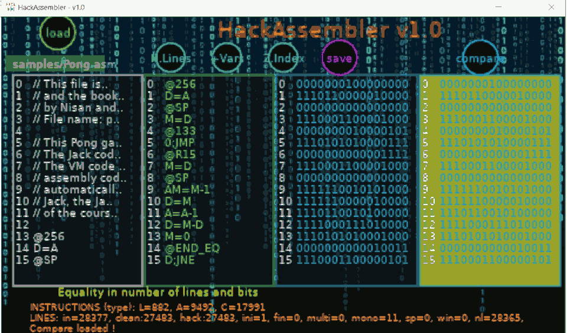

# <i style="display:none;">TOP</i>  
> -----------------------------------------------------------------------------------------------------  
>     
> '**HackAssembler**' (Lua LÖVE Program) - Ensamblador de archivos ".asm" de tipo "HACK". Siguiendo un curso en https://www.nand2tetris.org/course.  
> Author:  Juan José Guerra Haba - <dinertron@gmail.com> - Julio, 2024  
> Web:     https://guerratron.github.io/ , https://grtron.es  
> License: Free BSD. & Open GPL v.3. Keep credit, please.  
> Idea Original: **[GuerraTron24](https://guerratron.github.io/)**  
> Versión: 1.0.0  
> Proyect:    Hack-Assembler Lua-Löve      Package: /               Entry-Point: main.lua  
> 
> ----------------------------------------------------------------------------------------------------  

<h3 id="TOC">🏠︎ TOC 🖇️ (Tabla de contenidos)</h3>
 
- [⚙️ Información](#info)
- [📋 Antecedentes](#antecedentes)
- [⌨️ Caracteristicas](#caracteristicas)
- [🔧 Comandos](#comandos)
- [📌 Fuentes](#fuentes)
- [🎁 Agradecimientos](#agradecimientos)

📋 🔧 ⌨️ âŒ¨ 🖮  ⚙️ ğŸš€ 📌 ✒️ 🎁  âƒ âŒ‚ ☗ 🏠︎ ğŸšï¸ 🠠♥ ⤠â¤ï¸ 💖 ★ ⟠✨ â­ â­• 
〽️ ♯ ☑️ ✔️ ✓ ✗ ✖️ ❌ ❗ ❕ ❓ ❔ ⍰ ⯑ 🛈 ⚠ ⚠️ ⚿ ⛔︎ ⛔ 💣 🎈 🔡 🔣
‖ ” „ ƒ ∀ ⌬ ∅ ♖ ♜ 🏆︎ 🏆 🎰 🎮 🎖 🎖️ 🏅
🜉 ⌁ ⭍ 🗲 🗱 ⚡ ⍾ ⏚ ⏛ ⏦ 〰 ♒︎ ☁  ➕ ➖
⌛︎ ⏳︎ ∵ ⛬ 🝆 ⋙ ⭆ ⟹ ⇨ ⊳ ⌲ ➤ ⬀ 🔝 ∭ ↺ ⮔ 🔄 ∾ ∞ ⋈ ♾ ⊕ ⊚ ⌾ 🞇 ⬤ ⏺ ⚫︎ 🞑 🅢 🆂 Ⓢ 🅂 ╬ ⋮ Ξ π ω Ω ⅏ 🀰 🙼 🙾 
⛿ ⚐ ⚑ ⛳︎ 🏳️ 🏴 🏷️ ⚒ 🛠 ⚒️ ⚙ ⛯ ⛓ ⛓️ 🔗 ⛶ ⯐ ✉ ✉️ 📧 🌍︎ 🌍 ✎ ❒ 𝄝 𝄜 🎵 ☺ ☻ ☹ 👤 👦 💥 💤
🜲 🌡 🎚 🎚️ 📷︎ 📷 👁 👁️ 👀 📤︎ 📥︎ 🔓︎ 🔒 🔑 🕨 🕪 🔇 🔈 🔊 🕭 🔔 🔕 🕮 📖 🖋 🖈 📌 📎 📏 🖑 🖫 💾 🗎 📄 🗀 🗁 🗑 🗓 📆 📅 
📟 🗗 🗠 📈 📊 🗩 💬 📦 💯 🔋 ğŸ”

#  Hack-Assembler API v1.0 by [GuerraTron-24][authorEmail]

## INFO:
 ⚙️  
Ensamblador en **lenguage máquina HACK-ASM**, tanto de forma *mnemónica* (simbólica) como *binaria*, es un Ensamblador de archivos **.asm** de tipo **HACK** con una interfaz <abbr title="Read-Eval-Print-Loop">mini-REPL</abbr>.

Esta app convierte código **HACK-ASM** a binario **HACK-BIN** (con formato de *texto plano*) para poder reproducirse en la máquina virtual **"Hack Computer"**.

Digamos que es el **contenedor** para el ensamblador, ya que además puede realizar otras tareas (y más que se integrarán en futuras versiones) como para considerarse una herramienta con **múltiples usos**.

La app permite parsear un archivo *'\*.asm'* (con mnemónicos Hack) y convertirlo a *'\*.hack'* (binario en texto) todo ello de forma visualmente atractiva.

También permite la comparación del binario optenido con un segundo archivo *'\*.hack'* mostrando los resultados en la zona de mensajes inferior.

Tiene otros añadidos como <del>información in-situ de cada **bit transformado**, visualización de la tabla de **mapeo de la memoria**, otras tablas informativas sobre los principales campos y operaciones permitidas en la **ALU**, .. además como extra</del> poder obtener un código *ASM* final mucho más limpio y puro donde se sustituyen valores de **variables y labels** por sus referencias directas en el mapa de memoria. 

<i>"Espero que esta herramienta pueda servir de ayuda a otros programadores como lo ha sido para mí, para el parseo de archivos <b>asm pequeños va de lujo !</b>­"</i>  by GuerraTron24

ATENCIÓN: Debido a la naturaleza <b>OOP</b> la app consume bastantes recursos del ordenador (RAM) para parsear y mostrar todos los datos visualmente, también en parte por la utilización de los text-area como campos duplicados de líneas de archivo.  
Pero es INCREÍBLEMENTE RÁPIDA en el análisis de archivos medianamente grandes, por ejemplo con el archivo Pong.asm (500 Kb, 28377 líneas) la visualización y comparación así como el guardado de archivos de salvado ha sido INSTANTÁNEA, pero el consumo del programa en memoria ha resultado en unos "12 Mb". 
 
Por eso, <b>Hay que tener precaución</b> al utilizarlo en dispositivos con muy pocos recursos.

## ANTECEDENTES:
 📋  
 HackAssembler: Este es el resultado del completí­simo curso [NAND2Tetris] donde terminas construyendo, de forma ideal, un *PC* partiendo de los elementos más básicos como son las puertas lógicas **Nand** hasta elementos más complicados como estructuras de registros y memorias, ALU, .. hasta llegar a un **<abbr title="Virtual Computer">mini-VC</abbr>** con todo el *hardware* simulado mediante *software*.

Precí­samente este ensamblador es la práctica del tema *'6. Assembler'* donde instan a construir tu propio ensamblador para lenguage máquina *ASM-HACK-BIN* escrito en un lenguage de tu elección.
En este caso he elegido el lenguage **LUA** (utilizando el *framework* **LÖVE**), aunque también he creado otra versión más visual en **javascript** (pero infinitamente más lenta).

Esta versión se ha basado en otra anterior orientada a navegadores web codificada en javascript "HackAssembler.js v1.0.1".

## CARACTERISTICAS
⌨️  
Dos modos de funcionamiento con UI o sin ella, apariencia **REPL**, análisis **rapidísimo** del código *"asm"*, generación instantánea del código **Hack** y respaldo de otros archivos de utilidad en la carpeta del usuario del S.O.  

La parte más original de la APP, a mi parecer, es precísamente lo que no es "ensamblador", quiero decir la forma de llegar al ensamblador a través de una pantalla tipo **consola** o **terminal** ⌨️  donde se permiten introducir comandos como **asm** para la ejecución de este ensamblador, u otros como *help, dir, cmd, ver, exec, help, ..* .

Así que tenemos una app tipo **REPL**, con temática **retro-futurista**, con aspecto de app **terminal-8-bits** basado en consola tipo **MS-Dos**, con altas prestaciones y colores neón (casi **cyberpunk**), ... y encima programado en **LÖVE** (Lua 5.1), ...

 **¡ QUE MÁS SE PUEDE PEDIR !**, el disfrute está asegurado para todos los que añoren los **años 80's**.

 P.D: La APP sólo se ha podido probar en una máquina potente moderna (i7-64bits, 12Gb RAM, 2 Tb HDD) nada *retro-futurista*, y consume entre 2 y 30 Mb de memoria (dependiendo del tiempo de uso y la cantidad de comandos ejecutados).

## COMANDOS:
 🔧  
(BÁSICOS)  

    - asm. Pantalla para el Ensamblador donde comprobamos visualmente el código ASM-HACK y podemos realizar comparación con otros archivos Hack.
    - help. Pantalla de ayuda. 
    - exit. Salir de la APP guardando los avances conseguidos. 
    - escape. Salir de la APP SIN guardar los avances.
    - ... y muchos otros comandos de utilidad (escribir 'commands').

## FUENTES:
 📌  
https://www.nand2tetris.org/course

## AGRADECIMIENTOS
 🎁  
... Muchas gracias a todos, en especial: a [SheePolution](https://www.sheepolution.com/learn/book/contents) por su estupendo tutorial en *LÖVE* y en general a todo el mundo altruista que genera código y lo dispone open-source.  

... y sobre todo al mundo **terminal-cyberpunk** por la estética **retro-futurista** acuñada.  

> ✒️  
> :: BY: Juan Jose Guerra Haba <dinertron@gmail.com> GuerraTron24  

---
⌨️ con ❤️ por [Juan José Guerra][GuerraTron-Github] 😊

[<b style="font-size:xx-large; margin-left:50%;">🔝</b>](#top)

<!-- REFERENCIAS -->
[authorEmail]: mailto:dinertron@gmail.com  
[authorWeb]: https://grtron.es/ "Desarrollo web + app"  
[authorWeb2]: https://guerratron.github.io/  
[GuerraTron-Github]: https://github.com/guerratron/  
[NAND2Tetris]: https://www.nand2tetris.org/course "Pedazo curso"